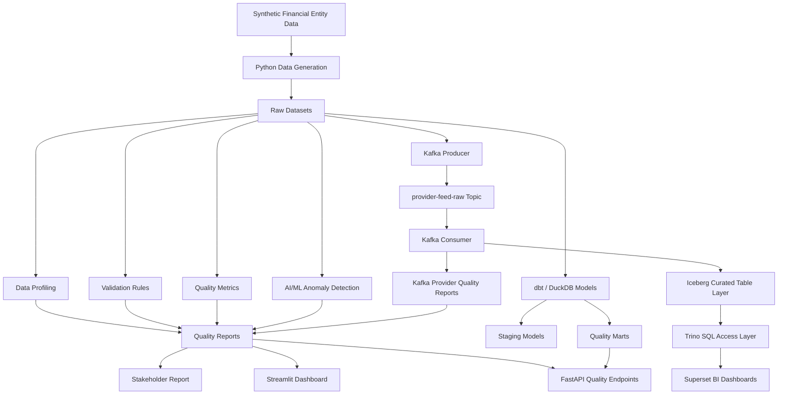

# EntityQ: Financial Entity Data Quality & Automation Framework


EntityQ is a modern data quality framework for synthetic financial entity and provider reference data. It simulates noisy data ingestion, data profiling, validation, anomaly detection, quality scoring, stakeholder reporting, and API-driven quality access.

## 1. Project Overview

EntityQ is a Python-based financial data quality framework for synthetic entity, issuer, counterparty, KYC, hierarchy, and provider-feed data. It combines generation, profiling, validation, SQL quality checks, remediation, APIs, dashboards, dbt/DuckDB, Kafka, and modern stack labs into one reproducible demo.

## 2. Why EntityQ Exists

Financial services rely on trusted reference data for critical workflows such as:

- entity onboarding and KYC
- counterparty risk assessment
- issuer mapping and market identification
- corporate hierarchy validation
- regulatory compliance and sanctions screening
- provider feed reconciliation and data integration

When reference and entity data is inaccurate, downstream systems produce stale risk assessments, broken relationships, duplicated records, and unreliable reporting.

EntityQ is built to show how a repeatable, automated data quality pipeline can be structured so quality issues are detected early, measured transparently, and surfaced to both data operations and business stakeholders.

## 4. What the Framework Does

EntityQ contains a complete end-to-end quality workflow:

- Generate synthetic financial entity and provider feed datasets
- Inject realistic data quality issues for testing
- Profile datasets for missingness, uniqueness, types, and value distributions
- Run validation rules against financial reference data quality dimensions
- Aggregate rule outcomes into scorecards and summaries
- Detect anomalies using machine learning techniques
- Produce stakeholder-ready markdown reports
- Expose quality outputs through FastAPI endpoints
- Support dbt/DuckDB quality marts and Kafka streaming validations
- Apply SQL-based onboarding checks for new incoming datasets
- Produce remediation summaries and quarantine/curation guidance for exception handling
- Explore [Apache Iceberg Lab](modern_stack/iceberg_lab/README.md) and [Trino Lab](modern_stack/trino_lab/README.md) for curated table and SQL access patterns

## Key Capabilities

- synthetic financial entity and provider feed generation
- configurable quality issue injection
- profiling and diagnostics for raw datasets
- rule-based validation and failed-rule reporting
- quality scorecards and metrics
- anomaly candidate detection
- stakeholder markdown report generation
- FastAPI REST API for quality outputs
- dbt/DuckDB model access for mart-level queries
- local Kafka producer and consumer flows for provider feed validation
- Streamlit dashboard support
- SQL-based dataset onboarding checks and remediation workflows
- [Apache Iceberg Lab](modern_stack/iceberg_lab/README.md)
- [Trino Lab](modern_stack/trino_lab/README.md)

## Supported Data Assets

| Dataset | Description |
|---|---|
| `entities.csv` | Master entity/reference data |
| `issuers.csv` | Issuer records linked to entities |
| `entity_hierarchy.csv` | Parent-child corporate hierarchy records |
| `kyc_attributes.csv` | KYC, risk, and counterparty attributes |
| `provider_feed.csv` | Third-party provider reference dataset |

## Quality Dimensions Covered

EntityQ evaluates data quality across:

- Completeness
- Validity
- Uniqueness
- Consistency
- Timeliness
- Referential integrity
- Hierarchy integrity
- Anomaly detection

## 5. How to Run the Full Demo

The recommended entry point is the full demo runner:

```bash
python -m entityq.run_full_demo
```

That command runs the core pipeline, the new counterparty onboarding workflow, the SQL quality checks, and the remediation / curation flow in sequence.

## 6. Core Pipeline

### 1. Install dependencies

```bash
python -m pip install -r requirements.txt
```

Use a virtual environment and Python 3.10+.

### 2. Run the core pipeline

```bash
python -m entityq.run_pipeline
```

This produces:

- `data/raw/*.csv`
- `data/quality_reports/*.csv`
- `data/quality_reports/stakeholder_report.md`
- `data/quality_reports/counterparty_trade_links_remediation_summary.md` (example remediation workflow output)
- `data/curated/counterparty_trade_links_curated.csv`
- `data/curated/counterparty_trade_links_quarantine.csv`
- `data/processed/entityq.duckdb` (if dbt/DuckDB has been run)
- `data/streaming/kafka_run_metadata.json` (after Kafka producer execution)

The core pipeline is intentionally narrower than the full demo. It covers data generation, profiling, validation, scoring, anomaly detection, and stakeholder reporting.

### 3. Run the full demo

```bash
python -m entityq.run_full_demo
```

This runs the core pipeline followed by the counterparty onboarding, SQL quality checks, and remediation workflow.

### 4. Start the API

```bash
uvicorn entityq.api:app --reload --host 127.0.0.1 --port 8000
```

### 5. Build the dbt/DuckDB mart

To enable `GET /dbt/entity-quality-summary`, run dbt from the `dbt/entityq` directory:

```bash
cd dbt/entityq
dbt run --profiles-dir .
```

### 6. Validate Kafka provider feed events

Publish events to Kafka:

```bash
python -m entityq.kafka_provider_producer
```

Consume and validate the latest run:

```bash
python -m entityq.kafka_provider_consumer
```

Generated outputs:

- `data/quality_reports/kafka_provider_quality_summary.csv`
- `data/quality_reports/kafka_provider_failed_events.csv`
- `data/streaming/kafka_provider_consumed_events.jsonl`

### 7. Launch the Streamlit dashboard

```bash
streamlit run dashboards/streamlit_app.py
```

The dashboard reads its source data from `data/quality_reports/`. If the pipeline has not been executed yet, the app will display informative warnings instead of failing.

## 7. New Dataset Onboarding

The framework handles a new dirty dataset through a simple repeatable flow:

1. Drop a CSV into `data/incoming`.
2. Register the dataset in `config/dataset_registry.yml`.
3. Run the onboarding checks with `python -m entityq.new_dataset_onboarding`.
4. Generate row-level failed-record exceptions and a stakeholder report.
5. Run the SQL quality checks with `python -m entityq.sql_quality_runner`.
6. Run remediation with `python -m entityq.counterparty_trade_remediation`.
7. Produce curated and quarantine outputs.
8. Expose the outputs through the API and Streamlit dashboard.

## 8. SQL Quality Checks

The counterparty onboarding SQL checks live in `sql/counterparty_trade_quality_checks.sql`. They are parsed and executed by `src/entityq/sql_quality_runner.py`, which writes:

- `data/quality_reports/sql_counterparty_trade_rule_results.csv`
- `data/quality_reports/sql_counterparty_trade_failed_records.csv`
- `data/quality_reports/sql_counterparty_trade_report.md`

## 9. Remediation and Curation

`src/entityq/counterparty_trade_remediation.py` keeps the raw dataset dirty and then applies safe standardisation only where the intended value is obvious. Records with blocking issues are quarantined for review, while safe records are written to curated output.

The remediation summary is saved at `data/quality_reports/counterparty_trade_links_remediation_summary.md` and highlights:

- incoming record count
- rows with issues
- curated versus quarantined split
- top quarantine reasons
- safe standardisations applied

## 10. Kafka Provider Feed Ingestion

The Kafka provider flow simulates event-based validation for provider feed data.

- Produce events with `python -m entityq.kafka_provider_producer`
- Consume and validate them with `python -m entityq.kafka_provider_consumer`

Expected outputs include the provider quality summary, failed events report, and consumed-event log in `data/quality_reports` and `data/streaming`.

## 11. dbt/DuckDB Layer

The dbt/DuckDB layer supports mart-level access to curated quality data. After running `dbt run --profiles-dir .` from `dbt/entityq`, the API can expose `GET /dbt/entity-quality-summary` from the local DuckDB database.

## 12. API Layer

The FastAPI service exposes the core quality outputs and the counterparty workflow outputs:

- `GET /health`
- `GET /quality/summary`
- `GET /quality/scorecard`
- `GET /quality/failed-rules`
- `GET /quality/anomalies`
- `GET /quality/stakeholder-report`
- `GET /dbt/entity-quality-summary`
- `GET /counterparty/rule-results`
- `GET /counterparty/failed-records`
- `GET /counterparty/sql-rule-results`
- `GET /counterparty/sql-failed-records`
- `GET /counterparty/remediation-summary`
- `GET /counterparty/curation-summary`

## 13. Streamlit Dashboard

The dashboard is organized into six tabs:

- Core Entity Quality
- Counterparty Dataset Onboarding
- SQL Quality Checks
- Curated vs Quarantine
- Kafka Provider Feed
- Remediation Summary

The main visual story is raw dirty dataset to failed rules to failed records to remediation to curated/quarantined split.

## API Endpoints

See the API Layer section above for the full endpoint list.

### Example request

```bash
curl http://127.0.0.1:8000/quality/scorecard
```

### Optional query parameters

`/quality/failed-rules` supports:

- `severity`
- `limit`

## Running Tests

Run the repository test suite with pytest:

```bash
pytest
```

The suite includes core pipeline smoke tests plus dedicated coverage for the dataset registry, onboarding workflow, SQL quality runner, and remediation workflow.

## Project Structure

```text
entityq-financial-data-quality-framework/
  README.md
  pyproject.toml
  requirements.txt
  config/
  data/
    incoming/
    raw/
    curated/
    processed/
    quality_reports/
    streaming/
  docs/
  modern_stack/
    iceberg_lab/
    trino_lab/
  sql/
  src/
    entityq/
      api.py
      anomaly_detection.py
      counterparty_trade_remediation.py
      data_generation.py
      kafka_provider_consumer.py
      kafka_provider_producer.py
      metrics.py
      new_dataset_onboarding.py
      profiling.py
      reporting.py
      run_full_demo.py
      run_pipeline.py
      sql_quality_runner.py
      validation.py
  tests/
  dashboards/
  notebooks/
  dags/
  dbt/
```

## Counterparty Workflow Outputs

The counterparty trade links example produces onboarding reports, SQL rule results, failed-record exceptions, curated outputs, quarantine outputs, and a remediation summary.

The orchestration command for the full demo is `python -m entityq.run_full_demo`.

## Dependencies and Tooling

Primary tools used in this project:

- Python 3.10+
- pandas
- numpy
- scikit-learn
- duckdb
- dbt-core
- dbt-duckdb
- fastapi
- uvicorn
- confluent-kafka
- streamlit
- plotly
- pytest
- tabulate
- Apache Iceberg (experimental curated table lab)
- Trino (experimental SQL access lab)

## 3. Architecture Diagram

EntityQ is built as a reference data quality pipeline with distinct ingestion, transformation, validation, scoring, reporting, and access layers. The repo also includes experimental lab components for Iceberg curated tables and Trino SQL access, demonstrating how a data-quality pipeline can surface validated assets to analytical query engines.



## 14. Modern Stack Labs: Trino, Iceberg, Superset

The repo also contains:

- dbt and DuckDB modeling for quality marts
- Streamlit dashboarding
- Airflow orchestration design notes
- GitHub Actions CI design patterns
- Kafka provider-feed ingestion and validation
- [Apache Iceberg Lab](modern_stack/iceberg_lab/README.md)
- [Trino Lab](modern_stack/trino_lab/README.md)
- Superset-style BI exploration

## 15. Role Alignment with Bloomberg

This project is aligned to a data engineering or data quality role because it demonstrates:

- financial reference-data thinking across entity, issuer, KYC, counterparty, hierarchy, and provider feed data
- repeatable onboarding and validation for dirty incoming datasets
- SQL-based quality checks and row-level exception handling
- remediation, curation, and quarantine workflows
- API and dashboard exposure for downstream consumers
- practical use of dbt, DuckDB, Kafka, Streamlit, FastAPI, Iceberg, and Trino

## 16. Project Limitations and Next Steps

Current limitations:

- Synthetic dataset only; no proprietary financial data is used.
- Iceberg, Trino, and Superset are local labs rather than production deployments.
- Kafka runs locally and simulates provider feed ingestion.
- Remediation rules are conservative and demonstrate workflow design rather than full enterprise MDM.

Next steps:

- expand the onboarding registry with more dirty datasets
- add more API and dashboard views for future workflows
- refine remediation coverage and add more regression tests
