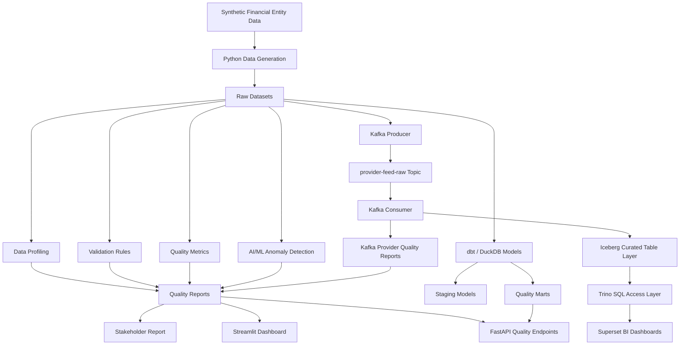

# EntityQ: Financial Entity Data Quality & Automation Framework


EntityQ is a reference data quality framework for financial entity and provider data. It generates synthetic raw datasets, injects realistic data quality issues, profiles records, validates rules, surfaces anomalies, and exposes quality outputs through reports, APIs, and modern analytics tooling.

## Business Problem

Financial institutions depend on clean reference data for entity onboarding, counterparty risk, sanctions screening, issuer mapping, corporate hierarchy analysis, and downstream reporting.

Common data quality failures include:

- missing or stale identifiers
- invalid country or classification codes
- broken issuer relationships and hierarchy chains
- duplicate or inconsistent entity records
- provider feed mismatches and poor supplier data quality
- noisy risk and KYC attributes

EntityQ demonstrates an end-to-end approach for surfacing those issues, measuring quality, and making remediation insights repeatable and auditable.

## Solution Overview

The framework combines synthetic data generation, profiling, validation, anomaly detection, reporting, API access, dbt/DuckDB marts, and Kafka streaming validation to simulate a modern financial data quality pipeline.

## Core Capabilities

- synthetic financial entity and provider feed data generation
- controlled injection of realistic data quality issues
- dataset profiling and reporting
- rule-based validation across completeness, uniqueness, validity, consistency, hierarchy, and referential integrity
- anomaly detection for entity records
- quality scorecards and stakeholder-ready markdown reporting
- FastAPI endpoints for quality summaries and failed rule analysis
- dbt/DuckDB model access for quality marts
- Kafka producer/consumer flows for provider feed validation
- Streamlit dashboard support and SQL examples

## Datasets

The established synthetic source datasets include:

| Dataset | Description |
|---|---|
| `entities.csv` | Master entity/reference data |
| `issuers.csv` | Issuer records linked to entities |
| `entity_hierarchy.csv` | Parent-child corporate hierarchy records |
| `kyc_attributes.csv` | KYC, risk and counterparty attributes |
| `provider_feed.csv` | Third-party provider reference feed |

## Data Quality Dimensions

EntityQ evaluates data quality across:

- Completeness
- Validity
- Uniqueness
- Consistency
- Timeliness
- Referential Integrity
- Hierarchy Integrity
- Anomaly Detection

## Getting Started

### 1. Install dependencies

```bash
python -m pip install -r requirements.txt
```

It is recommended to run this in a virtual environment using Python 3.10+.

### 2. Execute the pipeline

```bash
python -m entityq.run_pipeline
```

This generates:

- `data/raw/*.csv`
- `data/quality_reports/*.csv`
- `data/quality_reports/stakeholder_report.md`

### 3. Run the API

```bash
uvicorn entityq.api:app --reload --host 127.0.0.1 --port 8000
```

### 4. Build the dbt/DuckDB mart

To enable the `/dbt/entity-quality-summary` endpoint, run dbt from `dbt/entityq`:

```bash
cd dbt/entityq
dbt run --profiles-dir .
```

### 5. Kafka provider feed validation

Publish synthetic provider feed events to Kafka:

```bash
python -m entityq.kafka_provider_producer
```

Consume the latest run and produce Kafka quality reports:

```bash
python -m entityq.kafka_provider_consumer
```

This generates:

- `data/quality_reports/kafka_provider_quality_summary.csv`
- `data/quality_reports/kafka_provider_failed_events.csv`
- `data/streaming/kafka_provider_consumed_events.jsonl`

## API Endpoints

- `GET /health`
- `GET /quality/summary`
- `GET /quality/scorecard`
- `GET /quality/failed-rules`
- `GET /quality/anomalies`
- `GET /quality/stakeholder-report`
- `GET /dbt/entity-quality-summary`

`/quality/failed-rules` supports optional query parameters:

- `severity`
- `limit`

## Project Structure

```text
entityq-financial-data-quality-framework/
  README.md
  pyproject.toml
  requirements.txt
  config/
  data/
    raw/
    processed/
    quality_reports/
    streaming/
  docs/
  sql/
  src/
    entityq/
      api.py
      anomaly_detection.py
      data_generation.py
      kafka_provider_consumer.py
      kafka_provider_producer.py
      metrics.py
      profiling.py
      reporting.py
      run_pipeline.py
      validation.py
  tests/
  dashboards/
  notebooks/
  dags/
  dbt/
```

## Dependencies

Primary libraries used by the project:

- Python 3.10+
- pandas
- numpy
- scikit-learn
- duckdb
- dbt-core
- dbt-duckdb
- fastapi
- uvicorn
- confluent-kafka
- streamlit
- plotly
- pytest
- tabulate

## Architecture

EntityQ is designed as an end-to-end entity data quality and automation framework. It simulates financial data workflows around legal entities, issuers, corporate hierarchies, KYC attributes, counterparty risk, and provider feed validation.



## Additional Project Capabilities

The repository also supports:

- dbt and DuckDB modeling for quality marts
- Streamlit dashboarding
- Airflow orchestration design patterns
- GitHub Actions CI design
- Kafka provider-feed ingestion and validation
- Trino and Iceberg lab design references
- Superset-style BI exploration

## Professional Notes

This README is intended to reflect the current codebase and the latest functionality present in the repository. It is structured to help technical reviewers and stakeholders understand the project purpose, the data quality use case, the implementation parts, and the tools required to run the solution.
