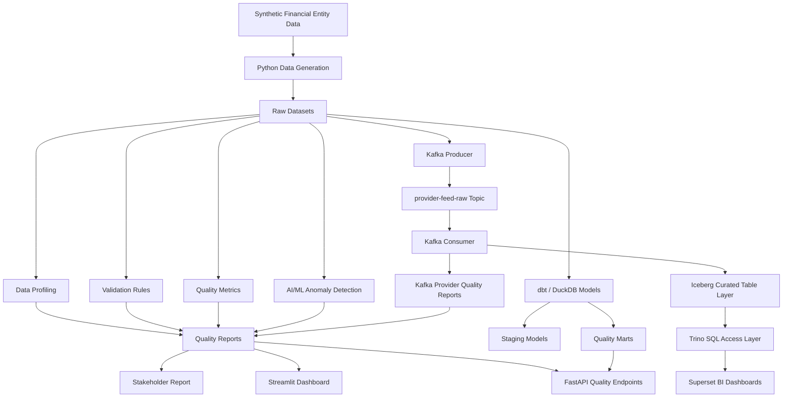

# EntityQ: Financial Entity Data Quality & Automation Framework


EntityQ is a modern data quality framework for synthetic financial entity and provider reference data. It simulates noisy data ingestion, data profiling, validation, anomaly detection, quality scoring, stakeholder reporting, and API-driven quality access.

## Why This Project Matters

Financial services rely on trusted reference data for critical workflows such as:

- entity onboarding and KYC
- counterparty risk assessment
- issuer mapping and market identification
- corporate hierarchy validation
- regulatory compliance and sanctions screening
- provider feed reconciliation and data integration

When reference and entity data is inaccurate, downstream systems produce stale risk assessments, broken relationships, duplicated records, and unreliable reporting.

EntityQ is built to show how a repeatable, automated data quality pipeline can be structured so quality issues are detected early, measured transparently, and surfaced to both data operations and business stakeholders.

## What the Project Does

EntityQ contains a complete end-to-end quality workflow:

- Generate synthetic financial entity and provider feed datasets
- Inject realistic data quality issues for testing
- Profile datasets for missingness, uniqueness, types, and value distributions
- Run validation rules against financial reference data quality dimensions
- Aggregate rule outcomes into scorecards and summaries
- Detect anomalies using machine learning techniques
- Produce stakeholder-ready markdown reports
- Expose quality outputs through FastAPI endpoints
- Support dbt/DuckDB quality marts and Kafka streaming validations

## Key Capabilities

- synthetic financial entity and provider feed generation
- configurable quality issue injection
- profiling and diagnostics for raw datasets
- rule-based validation and failed-rule reporting
- quality scorecards and metrics
- anomaly candidate detection
- stakeholder markdown report generation
- FastAPI REST API for quality outputs
- dbt/DuckDB model access for mart-level queries
- local Kafka producer and consumer flows for provider feed validation
- Streamlit dashboard support

## Supported Data Assets

| Dataset | Description |
|---|---|
| `entities.csv` | Master entity/reference data |
| `issuers.csv` | Issuer records linked to entities |
| `entity_hierarchy.csv` | Parent-child corporate hierarchy records |
| `kyc_attributes.csv` | KYC, risk, and counterparty attributes |
| `provider_feed.csv` | Third-party provider reference dataset |

## Quality Dimensions Covered

EntityQ evaluates data quality across:

- Completeness
- Validity
- Uniqueness
- Consistency
- Timeliness
- Referential integrity
- Hierarchy integrity
- Anomaly detection

## Quick Start

### 1. Install dependencies

```bash
python -m pip install -r requirements.txt
```

Use a virtual environment and Python 3.10+.

### 2. Run the pipeline

```bash
python -m entityq.run_pipeline
```

This produces:

- `data/raw/*.csv`
- `data/quality_reports/*.csv`
- `data/quality_reports/stakeholder_report.md`

### 3. Start the API

```bash
uvicorn entityq.api:app --reload --host 127.0.0.1 --port 8000
```

### 4. Build the dbt/DuckDB mart

To enable `GET /dbt/entity-quality-summary`, run dbt from the `dbt/entityq` directory:

```bash
cd dbt/entityq
dbt run --profiles-dir .
```

### 5. Validate Kafka provider feed events

Publish events to Kafka:

```bash
python -m entityq.kafka_provider_producer
```

Consume and validate the latest run:

```bash
python -m entityq.kafka_provider_consumer
```

Generated outputs:

- `data/quality_reports/kafka_provider_quality_summary.csv`
- `data/quality_reports/kafka_provider_failed_events.csv`
- `data/streaming/kafka_provider_consumed_events.jsonl`

## API Endpoints

The FastAPI service exposes:

- `GET /health`
- `GET /quality/summary`
- `GET /quality/scorecard`
- `GET /quality/failed-rules`
- `GET /quality/anomalies`
- `GET /quality/stakeholder-report`
- `GET /dbt/entity-quality-summary`

### Example request

```bash
curl http://127.0.0.1:8000/quality/scorecard
```

### Optional query parameters

`/quality/failed-rules` supports:

- `severity`
- `limit`

## Project Structure

```text
entityq-financial-data-quality-framework/
  README.md
  pyproject.toml
  requirements.txt
  config/
  data/
    raw/
    processed/
    quality_reports/
    streaming/
  docs/
  sql/
  src/
    entityq/
      api.py
      anomaly_detection.py
      data_generation.py
      kafka_provider_consumer.py
      kafka_provider_producer.py
      metrics.py
      profiling.py
      reporting.py
      run_pipeline.py
      validation.py
  tests/
  dashboards/
  notebooks/
  dags/
  dbt/
```

## Dependencies and Tooling

Primary tools used in this project:

- Python 3.10+
- pandas
- numpy
- scikit-learn
- duckdb
- dbt-core
- dbt-duckdb
- fastapi
- uvicorn
- confluent-kafka
- streamlit
- plotly
- pytest
- tabulate

## Architecture

EntityQ is built as a reference data quality pipeline with distinct ingestion, transformation, validation, scoring, reporting, and access layers.



## Additional Project Capabilities

The repo also contains:

- dbt and DuckDB modeling for quality marts
- Streamlit dashboarding
- Airflow orchestration design notes
- GitHub Actions CI design patterns
- Kafka provider-feed ingestion and validation
- Trino and Iceberg lab references
- Superset-style BI exploration

## Notes

This README is intended to provide a polished project overview for technical reviewers and stakeholders. It reflects the current codebase and the supported data quality capabilities in this repository.
