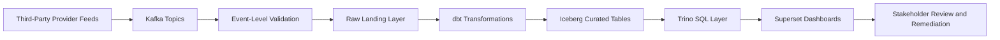
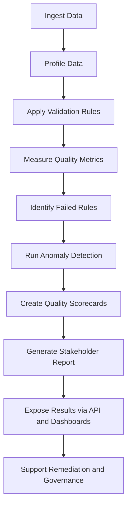

# EntityQ: Financial Entity Data Quality & Automation Framework


EntityQ is a financial entity data quality and automation framework built to simulate the type of reference, issuer, hierarchy, KYC, counterparty risk and third-party provider data challenges handled by large financial data organisations.

The project generates realistic synthetic financial entity datasets, deliberately injects data quality issues, profiles the data, validates quality rules, calculates quality scorecards, detects anomalies and produces stakeholder-ready reports.

## Business Problem

Financial data teams rely on accurate entity and reference data for workflows such as:

- client onboarding
- KYC review
- counterparty risk
- issuer classification
- corporate hierarchy analysis
- private markets research
- third-party provider data integration

Poor data quality can lead to duplicated entities, broken issuer relationships, stale risk reviews, missing identifiers, incorrect classifications and unreliable reporting.

EntityQ demonstrates how data quality controls can be embedded into a repeatable pipeline instead of being handled through manual checks.

## What the Project Does

EntityQ performs the following steps:

1. Generates synthetic messy financial entity data.
2. Profiles each dataset for missingness, uniqueness, data types and top values.
3. Runs validation rules across key data quality dimensions.
4. Produces rule-level validation results.
5. Aggregates rule results into quality scorecards.
6. Runs anomaly detection on entity records.
7. Produces a stakeholder-facing markdown report.
8. Provides SQL examples for schema design, quality checks and stakeholder views.

## Datasets

The project generates five synthetic raw datasets:

| Dataset | Description |
|---|---|
| `entities.csv` | Master entity/reference data |
| `issuers.csv` | Issuer records linked to entities |
| `entity_hierarchy.csv` | Parent-child corporate hierarchy records |
| `kyc_attributes.csv` | KYC, risk and counterparty attributes |
| `provider_feed.csv` | Third-party reference data provider feed |

## Data Quality Dimensions

EntityQ measures quality across:

- Completeness
- Validity
- Uniqueness
- Consistency
- Timeliness
- Referential Integrity
- Hierarchy Integrity
- Anomaly Detection

## Key Features

- Synthetic financial entity/reference data generation
- Realistic messy data injection
- Data profiling
- Rule-based data quality validation
- Quality scorecards
- Stakeholder reporting
- AI/ML-enabled anomaly detection
- SQL quality checks
- SQL stakeholder views
- FastAPI REST API for data quality summaries and DuckDB mart access
- Kafka provider feed producer/consumer for streaming quality validation
- Pytest smoke tests

## Tools Used

- Python
- Pandas
- NumPy
- scikit-learn
- SQL
- Pytest
- FastAPI
- Uvicorn
- Confluent Kafka
- Markdown
- DuckDB-ready SQL design
- Streamlit-ready reporting extension

## Getting Started

1. Install dependencies:

```bash
python -m pip install -r requirements.txt
```

2. Run the full EntityQ pipeline:

```bash
python -m entityq.run_pipeline
```

   This creates synthetic raw datasets and quality reports under `data/raw` and `data/quality_reports`.

3. Start the API service:

```bash
uvicorn entityq.api:app --reload --host 127.0.0.1 --port 8000
```

   To enable the `/dbt/entity-quality-summary` endpoint, run dbt in `dbt/entityq` first:

```bash
cd dbt/entityq
dbt run --profiles-dir .
```

4. Optionally publish provider feed events to Kafka:

```bash
python -m entityq.kafka_provider_producer
```

   Requires a local Kafka broker at `localhost:9092` by default.

5. Optionally consume provider events and produce Kafka quality reports:

```bash
python -m entityq.kafka_provider_consumer
```

   This writes:
   - `data/quality_reports/kafka_provider_quality_summary.csv`
   - `data/quality_reports/kafka_provider_failed_events.csv`
   - `data/streaming/kafka_provider_consumed_events.jsonl`

## API Endpoints

- `GET /health`
- `GET /quality/summary`
- `GET /quality/scorecard`
- `GET /quality/failed-rules`
- `GET /quality/anomalies`
- `GET /quality/stakeholder-report`
- `GET /dbt/entity-quality-summary`

`/quality/failed-rules` supports `severity` and `limit` query parameters.

## Project Structure

```text
entityq-financial-data-quality-framework/
  README.md
  pyproject.toml
  requirements.txt
  config/
  data/
    raw/
    processed/
    quality_reports/
    streaming/
  docs/
  sql/
  src/
    entityq/
      api.py
      anomaly_detection.py
      data_generation.py
      kafka_provider_consumer.py
      kafka_provider_producer.py
      metrics.py
      profiling.py
      reporting.py
      run_pipeline.py
      validation.py
  tests/
  dashboards/
  notebooks/
  dags/
  dbt/

  ## Architecture

EntityQ is designed as an end-to-end financial entity data quality and automation framework. It simulates financial reference data workflows involving legal entities, issuers, corporate hierarchies, KYC attributes, counterparty risk records, private markets-style entity data and third-party provider feeds.

```mermaid
flowchart TD
    A[Synthetic Financial Entity Data] --> B[Python Data Generation]
    B --> C[Raw Datasets]

    C --> D[Data Profiling]
    C --> E[Validation Rules]
    C --> F[Quality Metrics]
    C --> G Data Generation]
    B --> C[Raw Datasets]

    C --> D[Data Profiling]
    C --> E[Validation Rules]
    C --> F[Quality Metrics]
    C --> G[AI/ML Anomaly Detection]

    D --> H[Quality Reports]
    E --> H
    F --> H
    G --> H

    H --> I[Stakeholder Report]
    H --> J[Streamlit Dashboard]
    H --> K[FastAPI Quality Endpoints]

    C --> L[dbt / DuckDB Models]
    L --> M[Staging Models]
    L --> N[Quality Marts]
    N --> K

    C --> O[Kafka Producer]
    O --> P[provider-feed-raw Topic]
    P --> Q[Kafka Consumer]
    Q --> R[Kafka Provider Quality Reports]

    R --> H

    Q --> S[Iceberg Curated Table Layer]
    S --> T[Trino SQL Access Layer]
    T --> U[Superset BI Dashboards]
```

## Implemented Locally

EntityQ currently includes:

* synthetic financial entity data generation
* data profiling and validation rules
* data quality metrics and scorecards
* root-cause-oriented failed rule outputs
* AI/ML-enabled anomaly detection
* stakeholder-ready markdown reporting
* dbt and DuckDB staging and mart models
* FastAPI endpoints for quality outputs
* Streamlit dashboard layer
* Airflow orchestration design
* GitHub Actions CI design
* local Kafka provider-feed ingestion with producer and consumer scripts
* local Trino lab for distributed SQL exploration
* local Apache Iceberg lab using Spark, REST Catalog and MinIO
* local Superset lab for BI/dashboarding exploration

## Modern Data Stack Extension

The local project is designed to map into a production-style modern data stack:



## Data Quality Workflow

EntityQ follows a practical data quality workflow:



## Role Alignment

This project demonstrates practical experience across:

* data quality strategy
* data quality metrics
* data profiling
* root-cause investigation
* quality-by-design workflows
* Python and SQL automation
* PySpark-style data engineering patterns
* ETL validation and regression testing
* reference data and entity data quality
* issuer and corporate hierarchy data checks
* KYC and counterparty risk awareness
* third-party provider feed validation
* Kafka event ingestion
* dbt/DuckDB modelling
* Iceberg-style curated table architecture
* Trino SQL access patterns
* Superset-style stakeholder reporting
* FastAPI access to quality outputs
* workflow automation and CI/CD awareness
