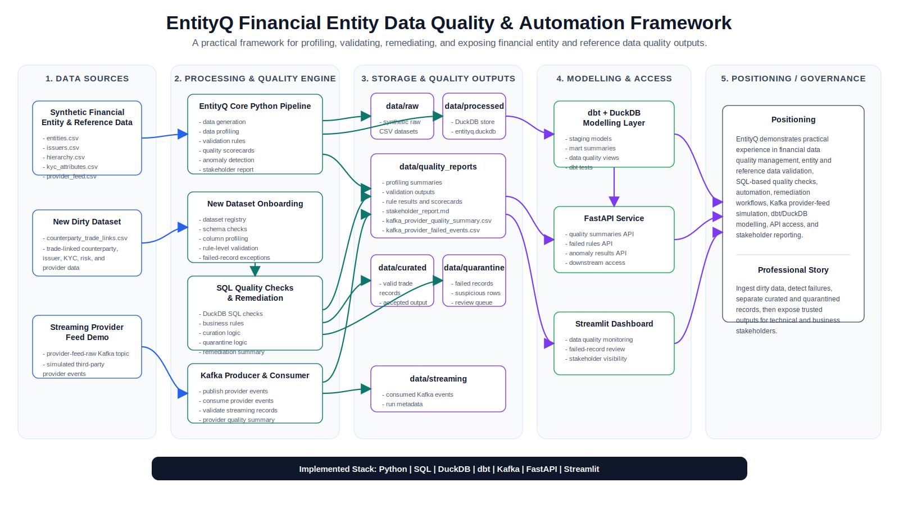

# EntityQ: Financial Entity Data Quality & Automation Framework


EntityQ is a modern data quality framework for synthetic financial entity and provider reference data. It simulates noisy data ingestion, data profiling, validation, anomaly detection, quality scoring, stakeholder reporting, and API-driven quality access.

## Project Overview

EntityQ is a Python-based financial data quality framework for synthetic entity, issuer, counterparty, KYC, hierarchy, and provider-feed data. It combines generation, profiling, validation, SQL quality checks, remediation, APIs, dashboards, dbt/DuckDB, Kafka, and modern stack labs into one reproducible demo.

## Why EntityQ Exists

Financial services rely on trusted reference data for critical workflows such as entity onboarding and KYC, counterparty risk assessment, issuer mapping, corporate hierarchy validation, regulatory compliance, sanctions screening, and provider feed reconciliation.

When reference and entity data is inaccurate, downstream systems produce stale risk assessments, broken relationships, duplicated records, and unreliable reporting.

EntityQ is built to show how a repeatable, automated data quality pipeline can be structured so quality issues are detected early, measured transparently, and surfaced to both data operations and business stakeholders.

## Architecture Diagram

EntityQ is organized as a layered pipeline that ingests synthetic, dirty, and streaming financial reference data; applies Python and SQL quality workflows; separates curated and quarantined outputs; and exposes quality results through dbt/DuckDB, FastAPI, and Streamlit.



## What the Framework Does

EntityQ contains a complete end-to-end quality workflow:

- Generate synthetic financial entity and provider feed datasets
- Inject realistic data quality issues for testing
- Profile datasets for missingness, uniqueness, types, and value distributions
- Run validation rules against financial reference data quality dimensions
- Aggregate rule outcomes into scorecards and summaries
- Detect anomalies using machine learning techniques
- Produce stakeholder-ready markdown reports
- Expose quality outputs through FastAPI endpoints
- Support dbt/DuckDB quality marts and Kafka streaming validations
- Apply SQL-based onboarding checks for new incoming datasets
- Produce remediation summaries and quarantine/curation guidance for exception handling
- Explore Apache Iceberg and Trino lab setups for curated table and SQL access patterns

## Supported Data Assets

| Dataset | Description |
|---|---|
| `entities.csv` | Master entity/reference data |
| `issuers.csv` | Issuer records linked to entities |
| `entity_hierarchy.csv` | Parent-child corporate hierarchy records |
| `kyc_attributes.csv` | KYC, risk, and counterparty attributes |
| `provider_feed.csv` | Third-party provider reference dataset |

## Quality Dimensions Covered

EntityQ evaluates data quality across completeness, validity, uniqueness, consistency, timeliness, referential integrity, hierarchy integrity, and anomaly detection.

## How to Run the Full Demo

The recommended entry point is the full demo runner:

```bash
python -m entityq.run_full_demo
```

That command runs the core pipeline, the new counterparty onboarding workflow, the SQL quality checks, and the remediation / curation flow in sequence. Kafka is intentionally excluded from the default demo because it requires a running local broker and is better treated as a separate streaming workflow.

## Core Entity Quality Pipeline

The core pipeline is intentionally narrower than the full demo. It covers synthetic data generation, profiling, validation, scoring, anomaly detection, and stakeholder reporting.

### Install dependencies

```bash
python -m pip install -r requirements.txt
```

Use a virtual environment and Python 3.10+.

### Run the core pipeline

```bash
python -m entityq.run_pipeline
```

This produces:

- `data/raw/*.csv`
- `data/quality_reports/*.csv`
- `data/quality_reports/stakeholder_report.md`

## Individual Stages

Run the main workflows separately when you want to inspect or debug a single layer:

```bash
python -m entityq.run_pipeline
python -m entityq.new_dataset_onboarding --dataset counterparty_trade_links
python -m entityq.sql_quality_runner
python -m entityq.counterparty_trade_remediation
python -m entityq.kafka_provider_producer
python -m entityq.kafka_provider_consumer
uvicorn entityq.api:app --reload --host 127.0.0.1 --port 8000
streamlit run dashboards/streamlit_app.py
```

The Kafka commands are kept separate from the full demo so the core workflow remains reproducible without requiring a local Kafka broker.

## New Dataset Onboarding

The framework handles a new dirty dataset through a repeatable flow:

1. Drop a CSV into `data/incoming`.
2. Register the dataset in `config/dataset_registry.yml`.
3. Run the onboarding checks with `python -m entityq.new_dataset_onboarding`.
4. Generate row-level failed-record exceptions and a stakeholder report.
5. Run the SQL quality checks with `python -m entityq.sql_quality_runner`.
6. Run remediation with `python -m entityq.counterparty_trade_remediation`.
7. Produce curated and quarantine outputs.
8. Expose the outputs through the API and Streamlit dashboard.

## SQL Quality Checks

The counterparty onboarding SQL checks live in `sql/counterparty_trade_quality_checks.sql`. They are parsed and executed by `src/entityq/sql_quality_runner.py`, which writes:

- `data/quality_reports/sql_counterparty_trade_rule_results.csv`
- `data/quality_reports/sql_counterparty_trade_failed_records.csv`
- `data/quality_reports/sql_counterparty_trade_report.md`

## Remediation and Curation

`src/entityq/counterparty_trade_remediation.py` keeps the raw dataset dirty and then applies safe standardisation only where the intended value is obvious. Records with blocking issues are quarantined for review, while safe records are written to curated output.

The remediation summary is saved at `data/quality_reports/counterparty_trade_links_remediation_summary.md` and highlights:

- incoming record count
- rows with issues
- curated versus quarantined split
- top quarantine reasons
- safe standardisations applied

## Kafka Provider Feed Ingestion

The Kafka provider flow simulates event-based validation for provider feed data.

- Produce events with `python -m entityq.kafka_provider_producer`
- Consume and validate them with `python -m entityq.kafka_provider_consumer`

Expected outputs include:

- `data/quality_reports/kafka_provider_quality_summary.csv`
- `data/quality_reports/kafka_provider_failed_events.csv`
- `data/streaming/kafka_provider_consumed_events.jsonl`

## dbt/DuckDB Layer

The dbt/DuckDB layer supports mart-level access to curated quality data. After running `dbt run --profiles-dir .` from `dbt/entityq`, the API can expose `GET /dbt/entity-quality-summary` from the local DuckDB database.

## API Layer

The FastAPI service exposes the core quality outputs and the counterparty workflow outputs:

- `GET /health`
- `GET /quality/summary`
- `GET /quality/scorecard`
- `GET /quality/failed-rules`
- `GET /quality/anomalies`
- `GET /quality/stakeholder-report`
- `GET /dbt/entity-quality-summary`
- `GET /counterparty/rule-results`
- `GET /counterparty/failed-records`
- `GET /counterparty/sql-rule-results`
- `GET /counterparty/sql-failed-records`
- `GET /counterparty/remediation-summary`
- `GET /counterparty/curation-summary`

## Streamlit Dashboard

The dashboard is organized into six tabs:

- Core Entity Quality
- Counterparty Dataset Onboarding
- SQL Quality Checks
- Curated vs Quarantine
- Kafka Provider Feed
- Remediation Summary

The main visual story is raw dirty dataset to failed rules to failed records to remediation to curated/quarantined split.

## Airflow Orchestration

EntityQ now includes an Airflow DAG at `orchestration/airflow/dags/entityq_quality_pipeline_dag.py` that coordinates the local quality workflow.

The DAG runs these tasks in order:

- `run_core_pipeline`
- `run_new_dataset_onboarding`
- `run_sql_quality_checks`
- `run_remediation_workflow`

Kafka tasks are intentionally not included in the default DAG because they require a running local Kafka broker.

Start Airflow with Docker Compose from the Airflow folder:

```bash
cd orchestration/airflow
docker compose up airflow-init
docker compose up -d
docker compose ps
```

Open the Airflow UI at `http://localhost:8080`, then trigger the `entityq_quality_pipeline` DAG from the UI.

Stop the environment when you are done:

```bash
docker compose down --volumes --remove-orphans
```

## Modern Stack Labs: Trino, Iceberg, Superset

The repo also contains:

- [Apache Iceberg Lab](modern_stack/iceberg_lab/README.md)
- [Trino Lab](modern_stack/trino_lab/README.md)
- Superset-style BI exploration
- dbt and DuckDB modeling for quality marts
- Streamlit dashboarding
- Airflow orchestration design notes
- GitHub Actions CI design patterns
- Kafka provider-feed ingestion and validation

These labs are intentionally framed as local demonstrations of curated table and distributed SQL access patterns, not production deployments.

## Validation

The repository test suite currently passes.

Last validated locally:

```bash
pytest -q
```

Result: 14 passed.

## Role Alignment with Bloomberg

This project is aligned to a data engineering or data quality role because it demonstrates:

- financial reference-data thinking across entity, issuer, KYC, counterparty, hierarchy, and provider feed data
- repeatable onboarding and validation for dirty incoming datasets
- SQL-based quality checks and row-level exception handling
- remediation, curation, and quarantine workflows
- API and dashboard exposure for downstream consumers
- practical use of dbt, DuckDB, Kafka, Streamlit, FastAPI, Iceberg, and Trino

## Limitations and Next Steps

Current limitations:

- Synthetic dataset only; no proprietary financial data is used.
- Kafka runs locally and simulates provider feed ingestion.
- Iceberg, Trino, and Superset are local labs rather than production deployments.
- Remediation rules are conservative and demonstrate workflow design rather than full enterprise MDM.

Next steps:

- expand the onboarding registry with more dirty datasets
- add more API and dashboard views for future workflows
- refine remediation coverage and add more regression tests

## Project Structure

```text
entityq-financial-data-quality-framework/
  README.md
  pyproject.toml
  requirements.txt
  config/
  data/
    incoming/
    raw/
    curated/
    processed/
    quality_reports/
    streaming/
  docs/
  modern_stack/
    iceberg_lab/
    trino_lab/
  sql/
  src/
    entityq/
      api.py
      anomaly_detection.py
      counterparty_trade_remediation.py
      data_generation.py
      kafka_provider_consumer.py
      kafka_provider_producer.py
      metrics.py
      new_dataset_onboarding.py
      profiling.py
      reporting.py
      run_full_demo.py
      run_pipeline.py
      sql_quality_runner.py
      validation.py
  tests/
  dashboards/
  notebooks/
  dags/
  dbt/
```
